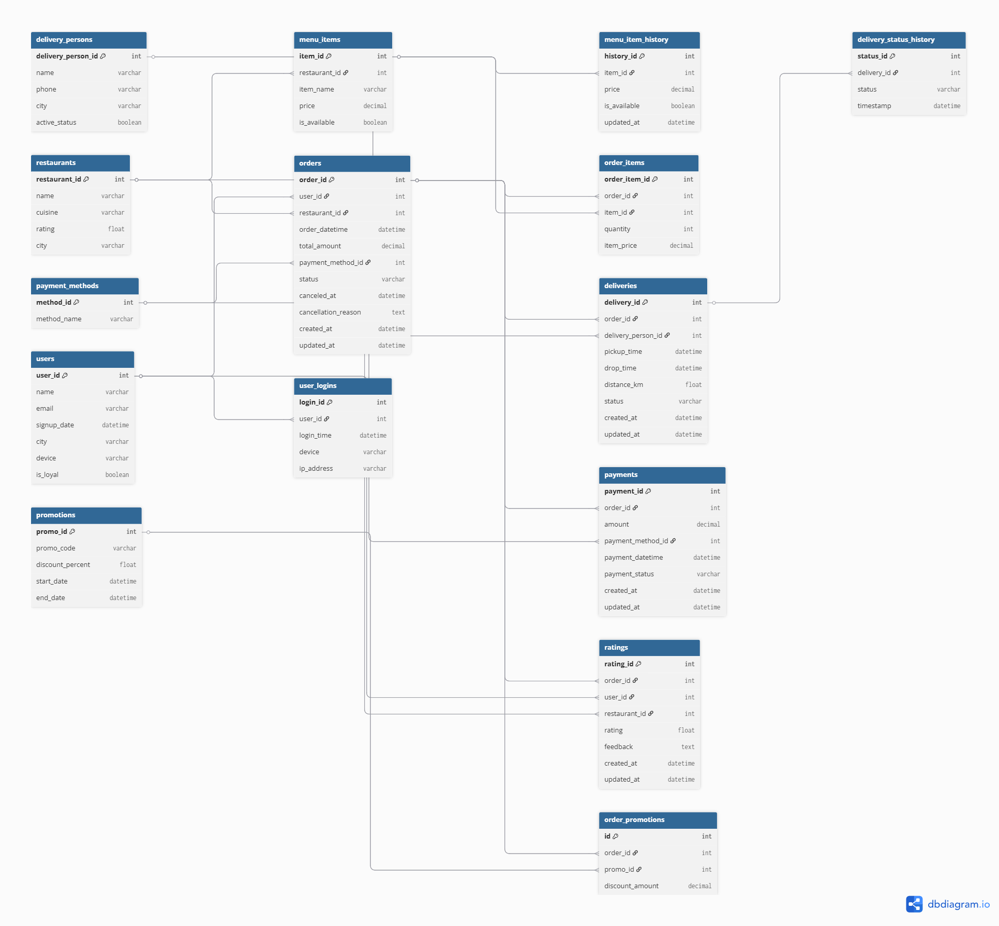
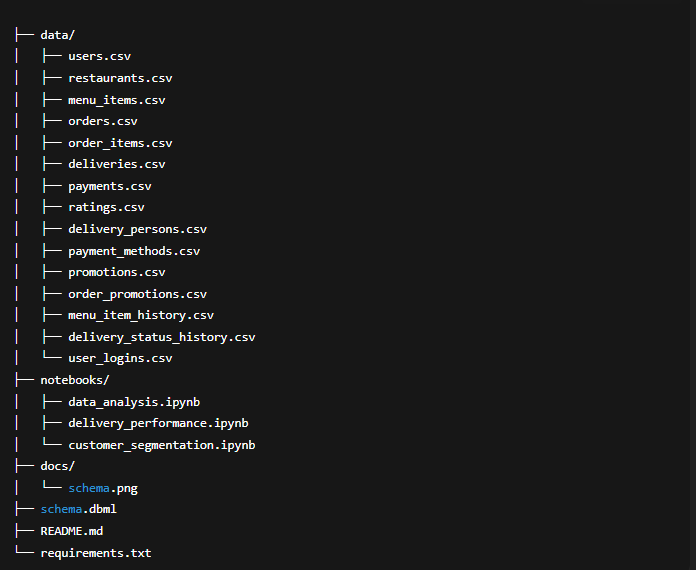

# E-Commerce Food Delivery Data Analytics Project

## Project Overview

This project focuses on analyzing an e-commerce food delivery platform, similar to companies like Delivery Hero or Uber Eats. My goal is to explore key business areas such as user behavior, restaurant performance, order patterns, delivery efficiency, payment methods, and customer satisfaction through comprehensive data analysis.

I designed and worked with a realistic, relational database schema that captures all essential aspects of the platform — including users, restaurants, menus, orders, deliveries, payments, and ratings — to simulate a real-world operational environment.

---
## Database Schema

### Schema Diagram

## Database Tables

The schema consists of the following main tables, designed to capture all relevant data points in the system:

| Table Name           | Description                                            |
|----------------------|--------------------------------------------------------|
| `users`              | Registered customers and their profile details          |
| `restaurants`        | Details of restaurants offering food                     |
| `menu_items`         | Menu items offered by restaurants                         |
| `orders`             | Customer orders with timestamps, status, and payment info |
| `order_items`        | Items included in each order                              |
| `delivery_persons`   | Delivery agents responsible for fulfilling orders        |
| `deliveries`         | Delivery events linked to orders with timing and status  |
| `payments`           | Payment records for orders including method and status   |
| `ratings`            | Customer feedback and ratings for orders and restaurants  |
| `payment_methods`    | Lookup table for normalized payment method types          |
| `promotions`         | Marketing campaigns offering discounts                    |
| `order_promotions`   | Discounts applied to orders via promotions                |
| `menu_item_history`  | Historical price and availability tracking for menu items |
| `delivery_status_history` | Status timeline for deliveries                        |
| `user_logins`        | User login activity tracking for behavioral analysis      |

---

## Table Relationships and Data Flow

- Each **user** can place multiple **orders**.
- Each **order** is linked to one **restaurant** and contains multiple **order_items**.
- Each **order_item** references a **menu_item** from the restaurant's menu.
- Orders are linked to one or more **payments**, normalized via the `payment_methods` table.
- Each **order** corresponds to one **delivery** fulfilled by a **delivery_person**.
- Deliveries have a **status history** tracking progress over time.
- Customers provide **ratings** and feedback per order and restaurant.
- **Promotions** can be applied to orders to offer discounts.
- **Menu items** have a historical log to track price changes.
- User login data supports behavioral and device usage analysis.

---

## Suggested Data Volume per Table

| Table                  | Suggested Number of Records | Notes                                                         |
|------------------------|-----------------------------|---------------------------------------------------------------|
| **users**              | 10,000                      | Diverse user base to reflect varied activity patterns          |
| **restaurants**        | 500                         | Variety of restaurants across multiple cities and cuisines      |
| **menu_items**         | 5,000                       | Approximately 10 menu items per restaurant                      |
| **orders**             | 50,000                      | Around 5 orders per user on average                             |
| **order_items**        | 120,000                     | Multiple items per order (avg ~2.4 items/order)                 |
| **delivery_persons**   | 200                         | Delivery staff to cover operational needs                       |
| **deliveries**         | 48,000                      | Successful deliveries for ~96% of orders                        |
| **payments**           | 50,000                      | One payment record per order                                    |
| **ratings**            | 25,000                      | About 50% of orders receive ratings/feedback                    |
| **payment_methods**    | 5                           | Common payment types like Credit Card, PayPal, Apple Pay, etc.  |
| **promotions**         | 50                          | Various marketing campaigns                                     |
| **order_promotions**   | 8,000                       | ~16% of orders use promotions                                   |
| **menu_item_history**  | 10,000                      | Tracks pricing and availability changes over time               |
| **delivery_status_history** | 150,000                | Multiple status updates per delivery (~3 updates per delivery)  |
| **user_logins**        | 80,000                      | Multiple logins per user (avg ~8 logins per user)               |

---
## Key Analytical Questions and Findings

This project aims to answer several critical business questions by analyzing the data:

### User & Order Analytics
- How do user signup trends vary by city and device?
- What percentage of users are loyal customers?
- What are the peak order times and popular cuisines?

### Restaurant & Menu Performance
- Which restaurants have the highest average ratings?
- How does menu item availability affect order frequency?
- How have menu item prices changed over time?

### Delivery & Logistics
- What is the average delivery time and distance?
- Which delivery persons have the highest completion rates?
- How often do deliveries experience delays or status changes?

### Payment & Promotions
- What are the most common payment methods?
- How effective are promotions in increasing order value or frequency?

### Customer Satisfaction & Feedback
- What is the distribution of customer ratings?
- Are there correlations between delivery time and ratings?
- What common feedback themes emerge in text comments?

---

## Key Questions & Insights from Food Delivery Dataset

## User Behavior & Segmentation
1. How many active users place orders monthly?  
2. What is the distribution of orders per user? (e.g., frequent vs occasional users)  
3. What percentage of users are loyal customers vs new users?  
4. Which cities have the highest user signup rates?  
5. What devices do users most commonly use to place orders?  
6. What is the average time between user signup and first order?  
7. How often do users log in before placing an order?  
8. Which users have the highest lifetime order value?  
9. What is the average order frequency per user?  
10. How do user order patterns vary by time of day or day of week?  

## Restaurant & Menu Insights
11. Which restaurants receive the most orders overall?  
12. What are the top cuisines ordered by users?  
13. How does restaurant rating correlate with the number of orders?  
14. Which menu items are the most popular across all restaurants?  
15. What is the average price per menu item by cuisine?  
16. How often do menu items go out of availability?  
17. How do menu item price changes affect sales volume?  
18. Which restaurants have the highest average order value?  
19. Are there restaurants with consistently low ratings? Why?  
20. Which cities have the most diverse cuisine options?  

## Order & Payment Analysis
21. What is the average order value (AOV) across the platform?  
22. How does AOV vary by user segment (loyal vs new)?  
23. What is the distribution of order statuses? (completed, canceled, etc.)  
24. What are the common cancellation reasons?  
25. Which payment methods are most popular among users?  
26. Is there a payment method associated with higher order success rates?  
27. How often do promotions get applied to orders?  
28. What is the average discount amount per promotion?  
29. How much revenue is generated from promoted orders vs regular orders?  
30. Are certain payment methods linked to higher order cancellation rates?  

## Delivery Performance
31. What is the average delivery time from pickup to drop-off?  
32. How does delivery time vary by city or region?  
33. Which delivery persons have the best on-time delivery rates?  
34. What percentage of deliveries experience status delays?  
35. How many delivery attempts are made before successful delivery?  
36. Are there delivery time patterns by time of day or day of week?  
37. How does delivery distance impact delivery time and user satisfaction?  
38. What is the average number of status updates per delivery?  
39. How often do delivery delays lead to order cancellations?  
40. Which delivery person has the highest customer rating?  

## Ratings & Feedback
41. What is the average customer rating per restaurant?  
42. Which restaurants have the most positive or negative feedback?  
43. How does customer rating correlate with order frequency?  
44. Are lower-rated orders more likely to be canceled or delayed?  
45. What keywords or themes appear most in customer feedback?  
46. How do ratings vary by cuisine or city?  
47. What percentage of orders receive customer ratings?  
48. Is there a difference in ratings between users on different devices?  
49. How do promotions affect customer satisfaction and ratings?  
50. What improvements can be identified from common feedback issues?  

---
## Technologies Used

- Python (Pandas, NumPy, Matplotlib, Seaborn)
- SQL (PostgreSQL / MySQL)
- DBML for database schema design
- Jupyter Notebooks for interactive data exploration

---

## How to Use This Repository

1. Explore the **DBML schema file** to understand the database structure.
2. Load the **sample datasets** (CSV files) corresponding to each table.
3. Run the **Python notebooks** to perform exploratory data analysis and visualization.
4. Modify queries and visualizations to fit new hypotheses or business needs.

---

## Contribution and Future Work

- Integrate real-time order and delivery data for live dashboards.
- Add customer segmentation based on order history and behavior.
- Implement predictive models for delivery time estimation and churn.
- Expand schema to include multi-restaurant orders and subscription services.

---

---

## License

This project is open source under the MIT License.

---

## Contact

For questions or collaborations, please contact:

**Nandu**  
Email: nandu26m.com  
GitHub: [github.com/nandu26m](https://github.com/nandu26m)

---

